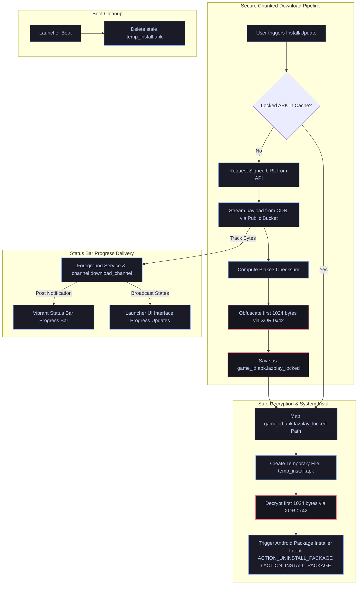

Lazplay — Android Launcher Architecture and Implementation Plan
Vision
The Android launcher is designed to:

simplify Android game access
manage APK installs and updates
support chunked downloads later
reduce repeated downloads
integrate platform identity and rewards
support future ecosystem features

The launcher should:

feel lightweight
work on low-end devices
minimize storage usage
minimize bandwidth usage
support unstable internet conditions

Core Goals
The Android launcher should:

allow browsing games
support APK downloads
support updates
verify downloads
cache downloads
support account login
integrate cosmetics/profile systems
support notifications
support future patching systems

Initial Release Scope (v1)
Main Features
Authentication

login/signup
account sessions
token storage
profile loading

Game Discovery
Launcher displays:

trending games
recent uploads
browser games
Android games
featured developers

APK Downloads
Launcher supports:

downloading APKs
resumable downloads
progress tracking
integrity verification

Install Management
Launcher can:

trigger APK install
track installed games
track versions
detect updates

Notifications
Possible notifications:

game updates
event notifications
rewards
developer announcements

Android Restrictions
Important Android Reality
Android does NOT allow:

silent APK installs
replacing apps automatically
unrestricted filesystem access

User must manually confirm installs.

Recommended Initial Architecture
Simple APK Distribution
Flow:
Player selects game
↓
Launcher downloads APK
↓
Launcher verifies file
↓
Launcher opens Android installer
↓
User confirms install

Launcher Architecture
Main Components
UI Layer
Handles:

browsing
downloads
profiles
cosmetics
notifications

Download Manager
Handles:

downloads
resumable downloads
retries
chunk downloading later
integrity checks

Cache System
Stores:

downloaded APKs
manifests
thumbnails
launcher assets

API Layer
Handles:

authentication
game metadata
ownership verification
signed URL requests
update checks

Recommended Tech Stack
Preferred Framework
Flutter
Reason:

already familiar
Android support
UI flexibility
future desktop expansion possible

Alternative
Native Android:

Kotlin

Better performance.
More complex development.

Authentication Flow
Login Flow
User logs in
↓
Server validates account
↓
Access token generated
↓
Launcher stores token securely

Recommended Storage
Use:

secure local storage

Avoid:

plain shared preferences for sensitive tokens

## 4. Production APK Download, Installation & Update Architecture

---

### A. Dynamic Blake3 Update Detection & Verification Flow

To prevent unauthorized uploads and ensure 100% data integrity, LazPlay uses client-side Blake3 hashing during the build pipeline:
1. **Developer Build Upload**: The developer CLI tool computes the **Blake3 checksum** of the final APK and transmits it to the API storefront server during manifest registration, storing it securely in the `checksumSha256` column.
2. **Dynamic Update Check**:
   - When the Android Launcher launches, it queries the backend API storefront using `/developer/games/:gameId` or `/developer/games` to fetch game metadata.
   - It retrieves the latest build's `checksumSha256` from the server.
   - It computes the local checksum of the currently installed application (or checks the registered package version in `GameDatabase`) and compares them.
   - If a mismatch is detected, the UI instantly transforms the "Play" button into a highlighted **"Update"** option.

---

### B. Separated Cache Clearance & Game Deletion Flow

In mobile environments, bandwidth is expensive while device storage is premium. To balance these two concerns, LazPlay decouples local APK caches from active Android installations:

1. **Delete Game Action**:
   - When a player clicks the "Delete" button on a game card inside their Library, the launcher **initiates a native uninstallation of the game from the Android device** (triggering the `ACTION_UNINSTALL_PACKAGE` or direct package scheme intent).
   - Crucially, the launcher **preserves the downloaded `.apk.lazplay_locked` cache file** in its secure cache folder.
   - This ensures that if the player wants to reinstall the game later, they do not have to waste bandwidth redownloading the large APK payload.
2. **Dedicated Cache Management Screen**:
   - The launcher's **Settings Page** is solely responsible for cache cleanup.
   - It provides a **"Clear Cache"** toggle or button that runs a deep cleanup routine, safely purging all `.apk.lazplay_locked` cache files and clearing up device memory.
3. **Manual Uninstall Tracking**:
   - If the user uninstalls a game manually from their Android device Settings (external to the launcher), this is intercepted by a registered `BroadcastReceiver` listening to `ACTION_PACKAGE_REMOVED`.
   - On detecting this event, the launcher's database updates the game's `installedStatus` state to `READY` (indicating it can be installed again from the cache), ensuring the UI instantly updates to show "Install" instead of "Play" next time the app loads.

---

### C. Native Status Bar Notification & Progress Bar Integration

To guarantee highly reliable download progress delivery on newer Android versions (12, 13, and 14+):
- **Foreground Service Integration**: The downloading engine starts a persistent `ForegroundService` that binds to the task lifecycle, preventing the system from killing the download when the launcher is pushed to the background.
- **Vibrant Notification Styling**:
  - Automatically registers a notification channel named `download_channel` with high priority.
  - Generates a real-time updating status bar notification with a dynamic progress bar, current throughput speed, and estimated time remaining.
  - Implements custom play/pause/cancel Action Buttons directly on the notification.
  - Uses `PendingIntent` flags `FLAG_IMMUTABLE | FLAG_UPDATE_CURRENT` for maximum security, compatibility, and responsiveness.

Web Game Support
Launcher Browser Integration
Launcher can:

open browser games
embed WebView later
support instant play

Recommended Initial Approach
Open web games externally.
Reason:

simpler
lower maintenance
better compatibility

Game Metadata System
Launcher Fetches
For each game:

title
icon
screenshots
developer
tags
version
size
update status

Offline Support
Initial Support
Launcher should cache:

thumbnails
manifests
installed game metadata

Future Offline Features
Possible later:

offline library
offline patch verification
cached store pages

Notification System
Notification Types
Examples:

update available
new game release
event rewards
game jam announcements
purchase confirmations

Cosmetic Integration
Launcher Displays
Player profile:

badges
profile themes
cosmetics
achievements

Analytics and Monitoring
Launcher Analytics
Track:

installs
updates
crashes
download failures
cache usage
retention

Anti-Abuse Considerations
Possible Abuse
Examples:

APK sharing
fake downloads
modified launchers
automation abuse

Basic Protection Methods
Use:

signed URLs
account validation
rate limits
ownership verification

Long-Term Launcher Vision
The Android launcher may eventually support:

chunked downloads
launcher-managed patching
cloud saves
social systems
achievements
launcher chat
game recommendations
cross-platform accounts

Recommended Development Phases
Phase 1 — Core Launcher
Build:

login
browsing
APK downloads
install flow
update checks
notifications

Phase 2 — Stability
Add:

resumable downloads
cache cleanup
integrity verification
analytics
crash handling

Phase 3 — Ecosystem Features
Add:

cosmetics
achievements
events
recommendations
profiles

Phase 4 — Advanced Distribution
Possible future:

chunked downloads
patching systems
shared asset caching
launcher optimization

Important Technical Philosophy
Android launcher should prioritize:

simplicity
reliability
low-end device support
low bandwidth usage
low RAM usage

Avoid:

overengineered patch systems initially

Recommended Initial Storage Structure
/launcher/cache/
/launcher/downloads/
/launcher/manifests/

Infrastructure Integration
Launcher integrates with:

Cloudflare Workers
R2 storage
authentication APIs
manifests
signed URLs

Final Philosophy
The Android launcher should:

reduce friction for mobile players
simplify Android game discovery
support indie developers
work reliably on weak devices
reduce repeated downloads
integrate into the Lazplay ecosystem

The goal is not to compete with Google Play.
The goal is:

ecosystem integration
indie distribution
low-friction discovery
community engagement

