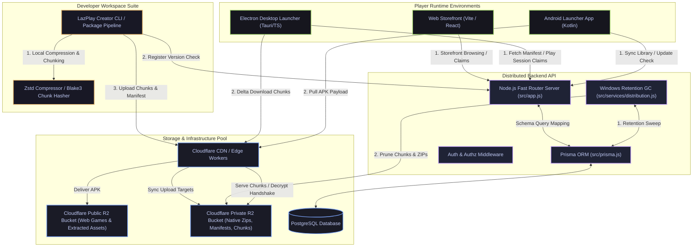
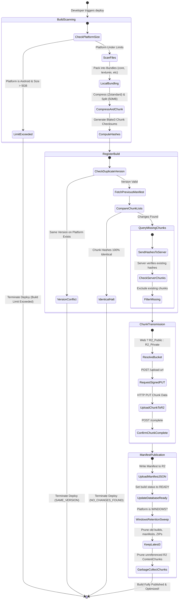
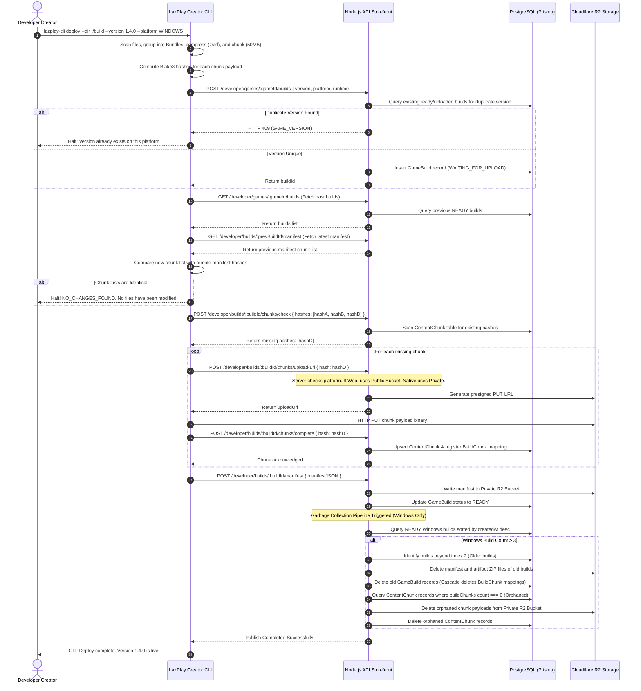
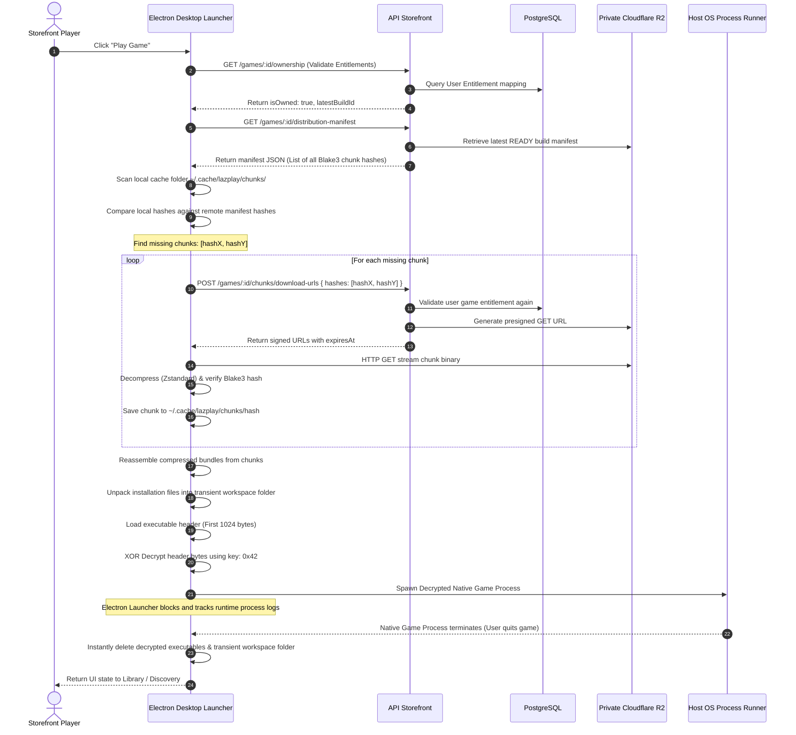
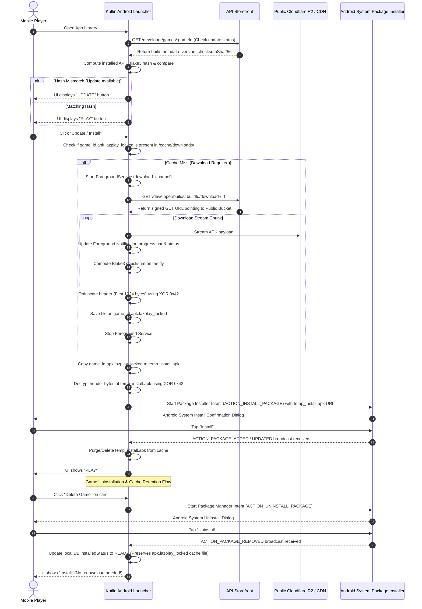
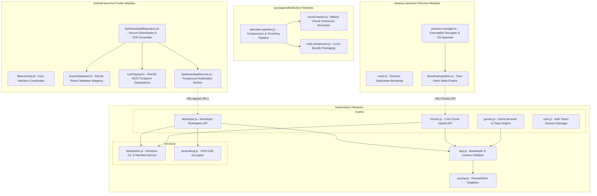

# LazPlay: Master System Architecture & Flow Specification Suite

This document represents the absolute authoritative specification for the entire LazPlay ecosystem. It integrates all workflows, platform subsystems, database representations, and cross-project interactions (API Server, Creator CLI, Web Storefront, Electron Launcher, and Android Launcher).

---

## 1. Entire System Architecture Overview

LazPlay is an advanced, high-performance self-hosted game distribution platform leveraging **Content-Addressed Storage (CAS)**, delta uploader/downloader engines, and dynamic security isolation pools.



---

## 2. Activity Diagram (Developer & Player End-to-End Workflow)

This activity diagram tracks a game build's lifecycle from the developer's computer to the player's runtime environment.



---

## 3. Sequential Diagrams

### A. Uploader & Version Retention Sequence
Tracks how the Creator CLI registers, checks, uploads, and purges older builds.



---

### B. Desktop Launcher Play Session & Delta Patching Sequence
Tracks launcher sync, signed storage requests, download delta, decapsulation, and XOR decryption.



---

### C. Android Launcher Update & Secure Background Installation Sequence
Tracks background service progress delivery, cache retention, decryption, and manual sync.



---

## 4. Entity-Relationship Diagram (ERD)

LazPlay's schema matches the PostgreSQL relational model managed via Prisma ORM.

```mermaid
erDiagram
    USER {
        string id PK
        string username UNIQUE
        string email UNIQUE
        string passwordHash
        string displayName
        string bio
        string avatarUrl
        string_array roles
        string status
        string banReason
        datetime banExpiresAt
        datetime createdAt
        datetime updatedAt
    }

    REFRESH_SESSION {
        string id PK
        string userId FK
        string refreshTokenId UNIQUE
        datetime expiresAt
        datetime revokedAt
        datetime createdAt
    }

    DEVELOPER_PROFILE {
        string id PK
        string userId FK "UNIQUE"
        string displayName
        string bio
        string website
        string supportEmail
        string verificationStatus
        string payoutStatus
        datetime createdAt
        datetime updatedAt
    }

    GAME {
        string id PK
        string developerId FK
        string slug UNIQUE
        string title
        string description
        string tagline
        int price
        string currency
        string priceType
        datetime pricingUpdatedAt
        string releaseDate
        string publisher
        string_array genres
        string_array tags
        string_array platforms
        string status
        boolean featured
        string coverUrl
        string coverObjectKey
        string heroImageUrl
        string heroBannerUrl
        string trailerUrl
        string trailerObjectKey
        string latestBuildId
        string version
        string licensingModel
        json hardwareSpecs
        json systemRequirements
        float rating
        int reviewCount
        datetime submittedAt
        datetime publishedAt
        string statusReason
        datetime createdAt
        datetime updatedAt
    }

    GAME_MEDIA {
        string id PK
        string gameId FK
        string type
        string url
        string alt
        int sortOrder
        datetime createdAt
    }

    GAME_BUILD {
        string id PK
        string gameId FK
        string version
        string platform
        string runtime
        string entrypoint
        string changelog
        string status
        string distributionType
        string artifactObjectKey
        string manifestObjectKey
        bigint sizeBytes
        string checksumSha256
        string scanStatus
        string scanMessage
        datetime uploadedAt
        datetime createdAt
    }

    CONTENT_CHUNK {
        string hash PK
        bigint sizeBytes
        string objectKey UNIQUE
        int refCount
        datetime createdAt
    }

    BUILD_CHUNK {
        string buildId PK, FK
        string hash PK, FK
    }

    BUILD_MANIFEST {
        string id PK
        string buildId FK "UNIQUE"
        string version
        json manifest
        int chunkCount
        bigint totalBytes
        datetime createdAt
        datetime updatedAt
    }

    DEPLOYMENT {
        string id PK
        string gameId FK
        string buildId FK
        string status
        string environment
        int progress
        string releaseNotes
        datetime completedAt
        datetime createdAt
    }

    DEPLOYMENT_LOG {
        string id PK
        string deploymentId FK
        string level
        string message
        datetime createdAt
    }

    GAME_REVIEW {
        string id PK
        string gameId FK
        string userId FK
        int rating
        string body
        datetime createdAt
        datetime updatedAt
    }

    GAME_PLAY_SESSION {
        string id PK
        string gameId FK
        string userId FK
        datetime startedAt
        datetime endedAt
        int durationSeconds
        datetime createdAt
    }

    LIBRARY_ITEM {
        string id PK
        string userId FK
        string gameId FK
        string ownershipType
        string installedStatus
        boolean favorite
        datetime lastPlayedAt
        int playtimeSeconds
        string installedBuildVersion
        boolean cloudSavesEnabled
        datetime createdAt
    }

    WISHLIST_ITEM {
        string id PK
        string userId FK
        string gameId FK
        datetime createdAt
    }

    ENTITLEMENT {
        string id PK
        string userId FK
        string gameId FK
        string source
        string status
        datetime grantedAt
    }

    ORDER {
        string id PK
        string userId FK
        string gameId FK
        string razorpayOrderId
        int amount
        string currency
        string status
        datetime createdAt
    }

    PAYMENT {
        string id PK
        string orderId FK
        string razorpayPaymentId
        int amount
        string currency
        string status
        datetime capturedAt
        datetime createdAt
    }

    STORAGE_OBJECT {
        string id PK
        string ownerId
        string objectKey UNIQUE
        string uploadId
        string purpose
        string fileName
        string contentType
        bigint sizeBytes
        string status
        string etag
        datetime completedAt
        datetime createdAt
    }

    USER ||--o{ REFRESH_SESSION : "owns"
    USER ||--o| DEVELOPER_PROFILE : "has"
    DEVELOPER_PROFILE ||--o{ GAME : "creates"
    GAME ||--o{ GAME_MEDIA : "has"
    GAME ||--o{ GAME_BUILD : "has"
    GAME ||--o{ DEPLOYMENT : "has"
    GAME_BUILD ||--o{ DEPLOYMENT : "referenced in"
    GAME_BUILD ||--o| BUILD_MANIFEST : "has"
    GAME_BUILD ||--o{ BUILD_CHUNK : "maps"
    CONTENT_CHUNK ||--o{ BUILD_CHUNK : "used in"
    DEPLOYMENT ||--o{ DEPLOYMENT_LOG : "has"
    GAME ||--o{ GAME_REVIEW : "receives"
    USER ||--o{ GAME_REVIEW : "writes"
    GAME ||--o{ GAME_PLAY_SESSION : "tracked in"
    USER ||--o{ GAME_PLAY_SESSION : "runs"
    USER ||--o{ LIBRARY_ITEM : "owns"
    GAME ||--o{ LIBRARY_ITEM : "added to"
    USER ||--o{ WISHLIST_ITEM : "wishes"
    GAME ||--o{ WISHLIST_ITEM : "listed in"
    USER ||--o{ ENTITLEMENT : "granted"
    GAME ||--o{ ENTITLEMENT : "unlocks"
    USER ||--o{ ORDER : "places"
    ORDER ||--o{ PAYMENT : "processed by"
```

---

## 5. Class / Module Architecture Diagram

This maps the code files, classes, repositories, and interfaces across the active workspaces.



---

## 6. Architectural Guarantees & Operational Specifications

1. **Content-Addressed Deduplication**: Standardizing on **Blake3 uploader hashes** permits global deduplication. If two different games share a common engine asset block, R2 stores it exactly once.
2. **Deterministic version control**: The `SAME_VERSION` uploader checker guarantees developers cannot overwrite existing ready builds, preserving release integrity.
3. **Reference-Safe Garbage Collection**: The `cleanupOldWindowsBuildsAndChunks` service evaluates the exact dependency graph in the database using foreign relations. Chunks are never deleted if they remain required by any of the 3 active/retained builds.
4. **Sandboxed Transient execution**: Native desktop games are only decrypted (first 1024 bytes XOR `0x42`) inside a volatile transient folder. Immediately upon exit, the Launcher purges the decrypted directory, minimizing casual piracy.
5. **Decoupled Mobile Cache Policies**: Keeping `.apk.lazplay_locked` cached payload downloads separate from the Android System package status reduces player bandwidth consumption. Reinstallation of a game requires zero network operations unless an update hash check indicates a version mismatch.
