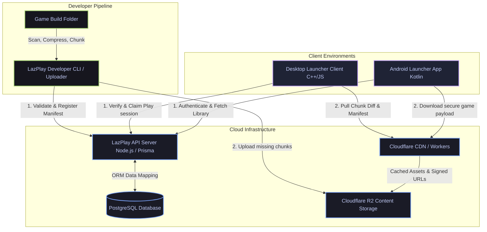
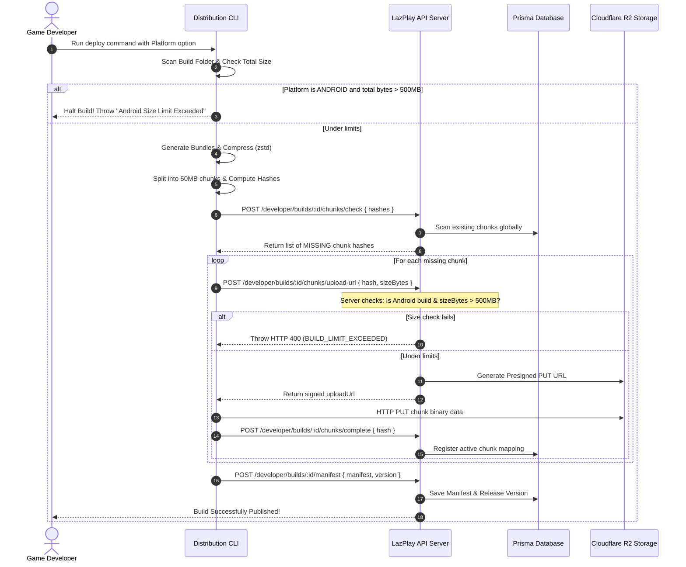
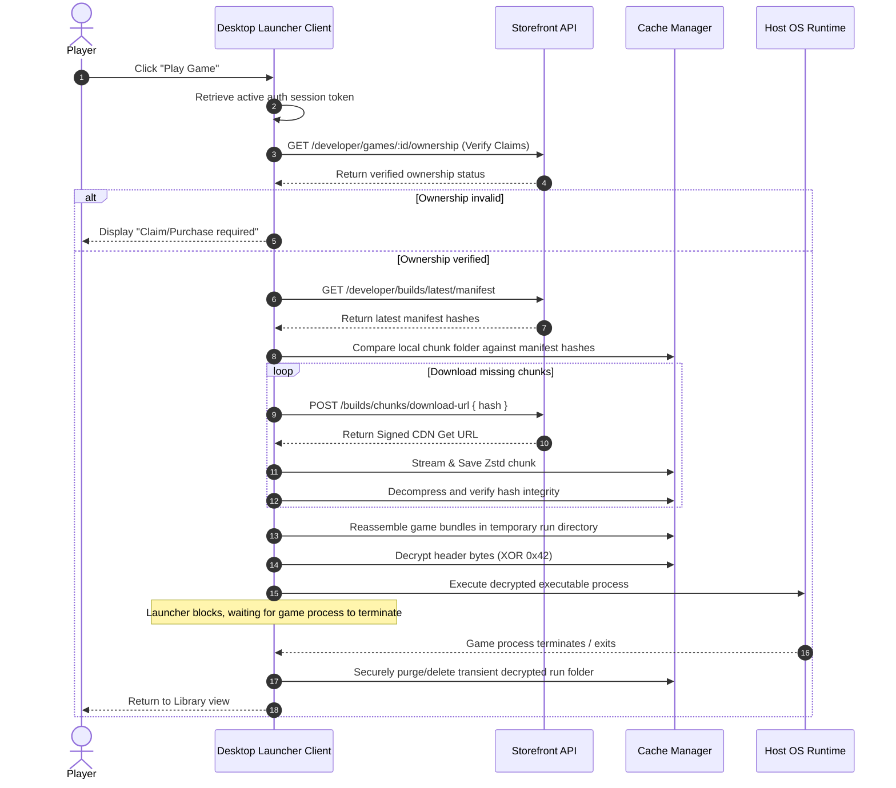
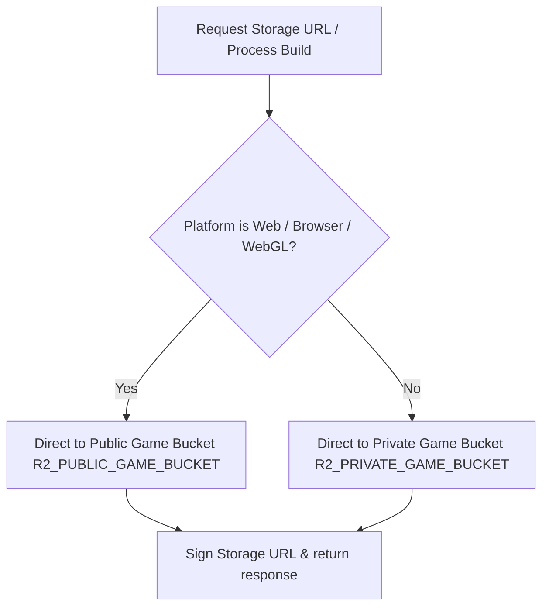
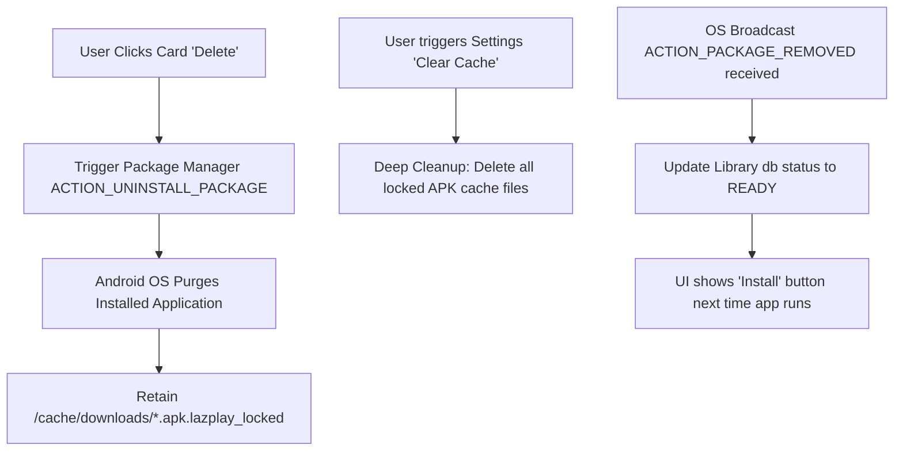

# LazPlay System Architecture & Implementation Specifications

This document outlines the core technical architecture, distribution workflows, security layers, and platform-specific constraints implemented across the LazPlay ecosystem.

---

## 1. High-Level System Architecture

The LazPlay platform is split into a robust, high-performance distributed backend service, a suite of developer uploader tools, and secure cross-platform client launchers (Desktop and Android).

---

## 2. Developer Upload & Delta Deduplication Pipeline

To minimize storage space, uploader bandwidth, and user patching wait times, LazPlay uses **Content-Addressed Storage (CAS)** and client-side delta chunking.

### Build Compression & Formatting
* **Scanning**: Directory scanning maps files and filters duplicates or unsupported extensions.
* **Size Enforcement**: Android builds are strictly capped at **500MB** (524,288,000 bytes). If a build is targeted for Android and exceeds this limit, scanning fails immediately.
* **Bundling**: Files are logically grouped into five core bundle categories (`core`, `textures`, `audio`, `maps`, `other`) to lower network overhead.
* **Compression**: Bundles are compressed locally using **Zstandard (zstd)** level 3–5.
* **Chunking**: Compressed bundles are split into **50MB chunks**.
* **Hashing & Identity**: Each chunk is hashed via SHA-256/BLAKE3. The hash forms the immutable key for that chunk in storage.

### Upload & Backend Deduplication Sequence

---

## 3. Client-Side Security Scrambling (Anti-Piracy)

To prevent unauthorized distribution, direct sideloading, or casual piracy of native games, LazPlay applies an identical XOR obfuscation layout across both Desktop and Android launcher environments.

### Obfuscation Specification
* **XOR Key**: `0x42`
* **Coverage**: The first `1024 bytes` of the game payload/APK file.
* **Integrity**: Files are stored locally on the user's storage in a "locked" state and are only dynamically decrypted into a transient form at the exact moment of execution or installation.

### Android secure download and installation architecture

Because Android enforces sandboxed application installers, the launcher must pass a clean, fully descrambled `.apk` file to the system Package Installer while keeping all cached files securely scrambled in its private storage.

```mermaid
graph TD
    Start[User triggers Game Install] --> CheckCache{Locked file in cache?}
    
    %% Download leg
    CheckCache -->|No| Download[Download Chunk stream via API URL]
    Download --> ComputeHash[Compute SHA-256 Checksum]
    ComputeHash --> Scramble[Scramble first 1024 bytes with XOR 0x42]
    Scramble --> SaveLocked[Save as game_id.apk.lazplay_locked]
    SaveLocked --> RegisterDB[Update status to DOWNLOADED in DB]
    
    %% Install leg
    CheckCache -->|Yes| Prepare[Load locked APK path from DB]
    RegisterDB --> Prepare
    
    subgraph Unlocking & Install Prompt
        Prepare --> Copy[Create temporary copy: temp_install.apk]
        Copy --> Descramble[Unscramble first 1024 bytes of temp_install.apk via XOR 0x42]
        Descramble --> Prompt[Prompt Android Package Installer with temp_install.apk]
    end

    subgraph Startup Cleanup
        Init[Launcher Boot / Init] --> CleanupTemp[Delete leftover temp_install.apk]
    end

    classDef process fill:#1f2335,stroke:#7aa2f7,stroke-width:1px;
    classDef security fill:#16161e,stroke:#f7768e,stroke-width:2px;
    class Start,Download,ComputeHash,RegisterDB,Prepare,Copy,Prompt,Init,CleanupTemp process;
    class Scramble,SaveLocked,Descramble security;
```

---

## 4. Desktop Launcher Game Claiming & Boot Flow

The Desktop Launcher interacts directly with the API to confirm purchases and claims, download delta-patched chunk streams, and decrypt game executables.

---

## 5. Dynamic S3/R2 Storage Isolation (Public Web vs Private Native)

To ensure secure compartmentalization and CDN scaling, LazPlay implements a strict, platform-aware bucket separation policy:

* **Web Games**: All Web game ZIP artifacts, extracted HTML5/WebGL/WASM runtime directories, and chunked files are stored in the **Public R2 Bucket** (`getPublicGameBucket()`). This permits direct, unauthenticated browser preloads, reducing load times.
* **Native Games (Windows, Linux, Android)**: All native platforms store their compressed build ZIPs, chunk files (`/chunks/<hash>`), manifests, and encryption-locked builds in the **Private R2 Bucket** (`getPrivateGameBucket()`). Downloads must be initiated via time-limited presigned storage URLs verified by storefront authentication hooks.

### S3/R2 Bucket Decision Flow

---

## 6. Android Installed Game Deletion vs Cache Preservation

Mobile players have strict bandwidth limits. To minimize redownloading large installation binaries while preserving local memory on demand, LazPlay decouples package uninstalls from cache retention:

* **Uninstallation Card Action**: Clicking "Delete" on a game card removes the compiled app from the Android operating system using the Package Manager (`ACTION_UNINSTALL_PACKAGE`), reclaiming runtime storage. However, the downloaded `.apk.lazplay_locked` cache file is **retained** in private app storage.
* **Settings Page Cache Purge**: A dedicated cache management panel in Settings handles the absolute deletion of `.apk.lazplay_locked` files from local disk memory.
* **Background OS Sync**: The app hooks into the `ACTION_PACKAGE_REMOVED` system broadcast receiver. If the user uninstalls a game manually through Android Settings, the local library db reflects the status change to `READY` immediately, altering the UI indicator to display "Install" instead of "Play" dynamically.

