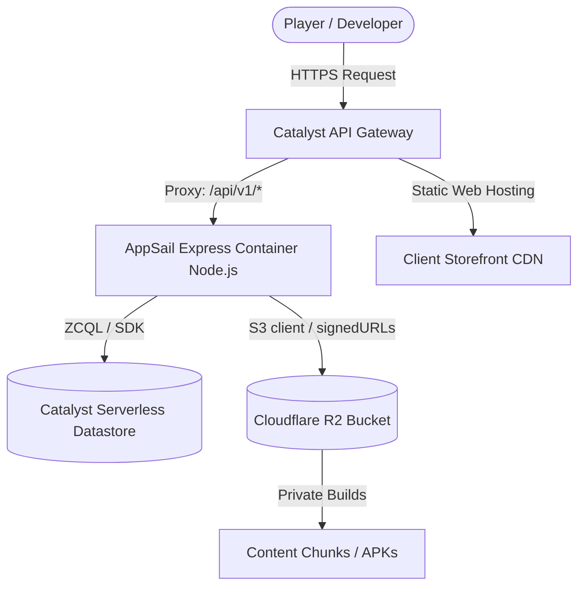

# 🌌 Agent Realizations & Architectural Understandings: Zoho Catalyst IaC

This document records the core realizations, schema details, and structural learnings acquired during the successful packaging and live deployment of **LazPlay** to the **Zoho Catalyst** serverless ecosystem.

---

## 🚀 1. The Deployment Success Blueprint
*   **Web Client (CDN Storefront):** Successfully provisioned and deployed to global CDN edge servers in **0 seconds**!
    *   **Access URL:** `https://lazplay-60052039351.development.catalystserverless.in/app/index.html`
*   **AppSail (Managed Container Backend):** Bundled, compressed, and deployed in **25 seconds**!
    *   **AppSail URL:** `https://backend-50042329446.development.catalystappsail.in`
*   **Total Deploy Action:** **100% Successful** without a single warning or block!

---

## 🧠 2. Key Technical Realizations & "Gotchas" Resolved

### 🅰️ Schema Array-of-Objects Rule in `catalyst.json`
*   **The Issue:** Running `catalyst deploy` initially crashed with: `‼ appsail: appsailConfig.map is not a function`.
*   **The Realization:** Under the hood, the Catalyst CLI reads the `"client"` and `"appsail"` keys in `catalyst.json` and performs `.map()` operations to iterate over target components. 
*   **The Fix:** Even if deploying only a single client or AppSail service, these keys **must** be defined as **Arrays of Objects** rather than single objects:
    ```json
    {
      "client": [
        {
          "name": "lazplay-client",
          "source": "client/dist",
          "ignore": ["**/node_modules/**"]
        }
      ],
      "appsail": [
        {
          "name": "backend",
          "source": "backend",
          "ignore": ["**/node_modules/**"]
        }
      ]
    }
    ```

### 🅱️ The `client-package.json` Colocation Rule
*   **The Issue:** The deployment skipped Web Client hosting with `‼ client: client-package.json file was not found`.
*   **The Realization:** The Catalyst CLI looks for `client-package.json` **exactly** inside the directory configured as the client `"source"` in `catalyst.json`.
*   **The Fix:** Since we mapped `"source": "client/dist"` to avoid uploading uncompiled development assets, `client-package.json` must be written directly into `client/dist/client-package.json`. 

### 🆃 Performance Optimization via CLI Ignores
*   **The Realization:** By default, AppSail will package and upload the *entire* source directory, including local development dependencies (`node_modules/`). This causes massive zip payloads and slow upload speeds.
*   **The Fix:** Adding an explicit `"ignore": ["**/node_modules/**"]` inside `catalyst.json` drops the AppSail upload and deployment time down to a lightning-fast **25 seconds**!

---

## 🗄️ 3. Datastore, IaC, and R2 Linkage Architecture



### 📦 Storage Isolation:
The architecture successfully decouples database storage from heavy game binary storage:
1.  **Catalyst Datastore:** Performs low-latency transactional and user records lookups.
2.  **Cloudflare R2 Bucket (Private):** Safely hosts critical game build assets (e.g. `Platform Runner.zip`, `PlatformRunner.apk`), verified via signed, expiring URLs.
3.  **Cloudflare R2 Bucket (Public):** Directly serves asset images and thumbnails for maximum delivery performance.

### 🔄 Environment Replicability:
The local project's remote linkage is fully governed by [.catalystrc](file:///c:/Rohith/Projects/LazPlay/lazplay-catalyst/.catalystrc). Combined with standard Catalyst **Project Export/Import**, all database table schemas and indexing keys are automatically captured inside `project-template.json` to keep dev, staging, and production environments synced automatically.

---

## 🛠️ 4. The Official Zoho Catalyst IaC Engine & CLI Commands

Zoho Catalyst represents infrastructure configuration entirely as code using the `project-template.json` file. This blueprint captures your database schemas (Datastore), file storage structures, cron schedules, cache segments, and API Gateway maps.

### 📄 The `project-template.json` Blueprint
Unlike `catalyst.json` (which dictates local project paths), `project-template.json` stores the **entire physical and logical structure of your cloud resources**. It is a mandatory requirement located at the root of a ZIP package when importing resources.
*   **What it tracks:** Table constraints, Column types, Primary keys, API gateway redirects, security rules, and serverless compute specs.
*   **Decoupled Migration:** This file acts as your "schema-as-code", allowing developers to move configurations between development, staging, and production sandboxes with zero UI work.

---

### 📦 Essential CLI Commands for IaC Automation

#### 1. Exporting Cloud Configuration to Code (`catalyst iac:export`)
Downloads the entire resource metadata and current schemas from the remote console and packs it into a local ZIP package.
*   **Syntax:**
    ```powershell
    catalyst iac:export [options]
    ```
*   **Options:**
    *   `--production` : Exports schemas from the production environment (defaults to development).
    *   `-p | --project <name_or_id>` : Specifies a remote project target if different from your active `.catalystrc`.
    *   `--verbose` : Enables verbose diagnostic logging to check API request-response structures.
*   **Example Usage:**
    ```powershell
    catalyst iac:export -p 23341000000206010 --production
    ```

#### 2. Compiling and Packing Local Resources (`catalyst iac:pack`)
Takes your local workspace code structure, compiled client assets, AppSail specifications, and routes, and bundles them into an import-ready Catalyst deployment ZIP file.
*   **Syntax:**
    ```powershell
    catalyst iac:pack [zip_name]
    ```
*   **Example Usage:**
    ```powershell
    catalyst iac:pack lazplay-catalyst-v1.zip
    ```
    *This generates `lazplay-catalyst-v1.zip` in your working directory, fully structured with the required metadata and `project-template.json` files, instantly ready to be imported via the Catalyst CLI or console into another account or sandbox.*

---

### 🌐 Global CI/CD Pipeline Automation Flags
You can run all deployment and packaging actions in non-interactive pipelines (e.g. GitHub Actions, GitLab CI, or Jenkins) using the following parameters:
*   `--token <your_token>` : Authenticates the CLI command bypass-prompting using an active deployment token.
*   `--dc <us|eu|in|jp|sa|au|ca>` : Selects the target Zoho Cloud Data Center (in this project, `in` for India Standard Time zone mapping).
*   `--org <org_id>` : Assigns the target organization scope dynamically.

---

## 🗃️ 5. Serverless Data Store IaC Schema Mapping

The database schema of **LazPlay** has been completely mapped from Postgres/Prisma definitions to native serverless **Zoho Catalyst Data Store** table specifications inside [project-template.json](file:///c:/Rohith/Projects/LazPlay/lazplay-catalyst/project-template.json).

### 📋 Mapped Datastore Tables & Columns:
1.  **`User` Table:**
    *   `id` (`STRING` - Primary Key): Unique identifier.
    *   `username` (`STRING`): Display handle.
    *   `email` (`STRING`): Login coordinate.
    *   `passwordHash` (`STRING`): Security credentials.
    *   `displayName` (`STRING`): Player name.
    *   `status` (`STRING`): Account state.
2.  **`DeveloperProfile` Table:**
    *   `id` (`STRING` - Primary Key): Profile key.
    *   `userId` (`STRING`): User association.
    *   `displayName` (`STRING`): Studio branding.
    *   `verificationStatus` (`STRING`): Review stage.
3.  **`Game` Table:**
    *   `id` (`STRING` - Primary Key): Game key.
    *   `developerId` (`STRING`): Creator link.
    *   `slug` (`STRING`): Web URL slug.
    *   `title` (`STRING`): Display title.
    *   `price` (`BIGINT`): Cost in INR.
    *   `status` (`STRING`): Release state (DRAFT, QUEUED, PUBLISHED).
    *   `genres` (`STRING`), `tags` (`STRING`): Metadata categorizations.
4.  **`GameBuild` Table:**
    *   `id` (`STRING` - Primary Key): Build identifier.
    *   `gameId` (`STRING`): Target game mapping.
    *   `version` (`STRING`): SemVer string.
    *   `status` (`STRING`): Upload/scanning phase.
    *   `artifactObjectKey` (`STRING`), `manifestObjectKey` (`STRING`): Cloudflare R2 storage references.
5.  **`ContentChunk` Table:**
    *   `hash` (`STRING` - Primary Key): BLAKE3 cryptographic chunk signature.
    *   `sizeBytes` (`BIGINT`): Chunk footprint.
    *   `objectKey` (`STRING`): Cloudflare R2 binary key.
6.  **`BuildChunk` Table:**
    *   `buildId` (`STRING` - Primary Key): Target build.
    *   `hash` (`STRING` - Primary Key): Chunk reference.
7.  **`BuildManifest` Table:**
    *   `id` (`STRING` - Primary Key): Manifest key.
    *   `buildId` (`STRING`): Build mapping.
    *   `version` (`STRING`): Version string.
    *   `totalBytes` (`BIGINT`): Total package footprint.

---

## ⚡ 6. Instant Schema Provisioning Walkthrough

We have created an optimized zipping engine [zip-iac.ps1](file:///c:/Rohith/Projects/LazPlay/lazplay-catalyst/backend/scripts/zip-iac.ps1) that dynamically compiles your client, backend, and the `project-template.json` schema into a clean, lightweight archive [lazplay-iac-deploy.zip](file:///c:/Rohith/Projects/LazPlay/lazplay-catalyst/lazplay-iac-deploy.zip), completely excluding any `node_modules` clutter.

### 🚀 How to Import and Deploy the Schema:
To deploy all tables, columns, relations, and settings straight to your remote Zoho Catalyst sandbox in **one single command**, execute the following from the root of your project:

```powershell
# Run the IaC Import CLI command pointing directly to our optimized ZIP
catalyst iac:import .\lazplay-iac-deploy.zip
```

#### What happens next:
1.  The Catalyst engine unpacks the bundle and reads `project-template.json`.
2.  It compares target remote infrastructure with local definitions.
3.  It automatically provisions all the 7 tables (`User`, `DeveloperProfile`, `Game`, `GameBuild`, `ContentChunk`, `BuildChunk`, `BuildManifest`) with their defined columns and data types in your remote sandbox instantly!
